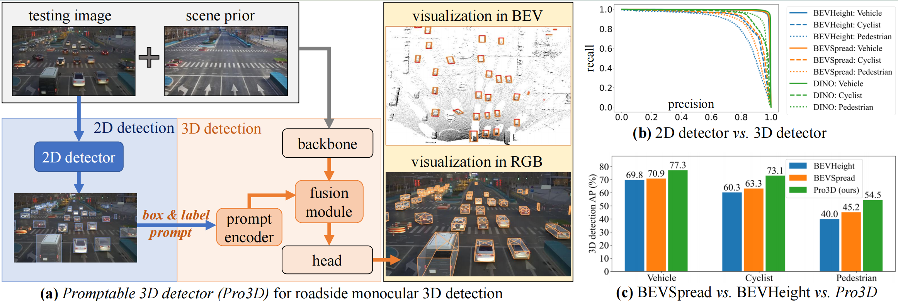

<div align="center">
<h1>Pro3D: Roadside Monocular 3D Detection Prompted by 2D Detection</h1>


**Yechi Ma**<sup>1,2</sup> · [**Yanan Li**](https://yananlix1.github.io/)<sup>2</sup> · **Wei Hua**<sup>2,1</sup> · [**Shu Kong**](https://aimerykong.github.io/)<sup>3,4,*</sup>

<sup>1</sup>Zhejiang University&emsp;&emsp;&emsp;<sup>2</sup>Zhejiang Lab&emsp;&emsp;&emsp;<sup>3</sup>University of Macau&emsp;&emsp;&emsp;<sup>4</sup>Institute of Collaborative Innovation
<br>

<a href="https://arxiv.org/abs/2404.01064"></a>
</div>

Pro3D is a novel vision-based roadside monocular 3D object detector that establishes new state-of-the-art performance. On the DAIR-V2X-I benchmark, Pro3D demonstrates significant improvements over BEVSpread with margins of **6.4% (vehicle)**, **9.8% (cyclist)**, and **9.3% (pedestrian)** across respective classes.



---

## 🚀 News
* [2025/11/25] : [arXiv paper](https://arxiv.org/abs/2404.01064) released.
* [2025/11/22] : Pro3D is accepted to WACV 2026.

---

## 📝 Catalog
- [ ] Training Code
- [ ] Checkpoints
- [ ] Inference Code
- [x] Jupter Notebok Demo
- [x] Initialization

---

## 🔍 Quick Start: Interactive Demo (Recommended First Step)

Before proceeding with full pipeline implementation, we strongly recommend exploring our **pre-configured demonstration notebook**:

📚 **[▶️ demo-pro3d-infer-vis.ipynb](./demo-pro3d-infer-vis.ipynb)**  
*This interactive notebook provides:*
- End-to-end inference pipeline visualization  
- Sample detection results with 3D bounding boxes  
- Core feature demonstrations  
- Environment validation checks  

> ⚠️ *Note: The complete production codebase is currently undergoing active development. While the demo reflects current capabilities, the full implementation will receive significant architectural improvements and expanded functionality in upcoming releases.*

---

## 📑 Table of Contents
<details open style="padding: 10px; border-radius: 5px 30px 30px 5px; border: 1px solid #ddd;">
  <summary><b>Contents</b></summary>
  <ol>
    <li><a href="#getting-started">Getting Started</a></li>
    <li><a href="#acknowledgments">Acknowledgments</a></li>
  </ol>
</details>

---

## 🛠️ Getting Started

### 1. Prerequisites
- [Installation Guide](docs/install.md) *(GPU environment setup)*
- [Dataset Preparation](docs/prepare_dataset.md) *(DAIR-V2X-I/Rope3D conversion)*

### 2. Core Workflow

#### Generate the scene priors
```
python scripts/gen_scene_prior.py
```

#### Train Pro3D
```
python [EXP_PATH] --gpus 8 -b 32
```
#### Eval Pro3D
```
python [EXP_PATH] --ckpt_path [CKPT_PATH] --gpus 1 -e
```

---

## 🙏 Acknowledgments

This project leverages foundational work from these critical repositories:

| Project       | Purpose                          | Link |
|---------------|----------------------------------|------|
| **BEVSpread** | Voxel pooling innovation         | [GitHub](https://github.com/DaTongjie/BEVSpread) |
| **BEVHeight** | Height-aware feature learning    | [GitHub](https://github.com/ADLab-AutoDrive/BEVHeight) |
| **BEVDepth**  | Reliable depth estimation        | [GitHub](https://github.com/Megvii-BaseDetection/BEVDepth) |
| **DAIR-V2X**  | Real-world roadside dataset      | [GitHub](https://github.com/AIR-THU/DAIR-V2X) |
| **Rope3D**    | Challenging 3D detection dataset | [GitHub](https://github.com/liyingying0113/rope3d-dataset-tools) |

> **Development Status**: The codebase is actively evolving. Major architecture improvements and additional features will be released in subsequent versions. Current implementations reflect our validated research baseline.

---
## 📚 Citation

If you use Pro3D in your research, please cite our work:
```
@inproceedings{ma2025pro3d,
  title={Roadside Monocular 3D Detection Prompted by 2D Detection}, 
  author={Yechi Ma and Yanan Li and Wei Hua and Shu Kong},
  booktitle={Proceedings of the IEEE/CVF Winter Conference on Applications of Computer Vision (WACV)},
  year={2026}
}
```
---
## 📚 References
1. Performance comparisons based on DAIR-V2X-I benchmark (CVPR 2024)
2. All cited projects contain their respective citation requirements

